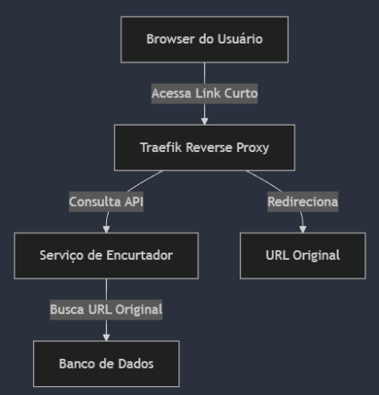

# Encurtador-de-links

## Fluxo e arquitetura do sistema
<p align="center">
  
</p>

## Acesso a documentação via Swagger:
```
http://localhost:8080/swagger-ui/index.html
```

## Fluxo do Traefik para o roteamento:
```
Requisição: short.local/login
↓
Router: shortlink-auth (rule = Host(`short.local`) && PathPrefix(`/login`))
↓
Middleware: shortlink-auth-prefix (adiciona /api/auth)
↓
Service: shortlink-auth-service (aponta para porta 8080 do container spring-app)
↓
App: responde em /api/auth/login
```

## Configurando o DNS para resolver o path short.link
### Windows
1. Abra o CMD como administrador e rode:
``` 
echo 127.0.0.1 short.local >> C:\Windows\System32\drivers\etc\hosts
```
2. Depois, limpe o cache DNS rodando:
```
ipconfig /flushdns
```
3. Teste as configurações rodando:
```
ping short.local
```
4. O resultado deve ser:
```
Pinging short.local [127.0.0.1]
```

### Linux
1. Abra o terminal e rode:
```
echo "127.0.0.1 short.local" | sudo tee -a /etc/hosts
```
2. Verifique se foi adicionado rodando:
```
grep short.local /etc/hosts
```
     ✅Saída esperada:
          127.0.0.1 short.local

3. (Ocasional) Forçar a atualização/limpeza do cache DNS rodando:
```
sudo systemd-resolve --flush-caches

ou

sudo service nscd restart
```
4. Testar a implementação rodando:
```
ping short.local
```

     ✅Saída esperada:
     PING short.local (127.0.0.1) 56(84) bytes of data.
     64 bytes from short.local (127.0.0.1): icmp_seq=1 ttl=64 time=0.038 ms
